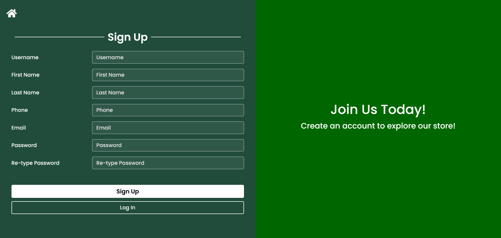
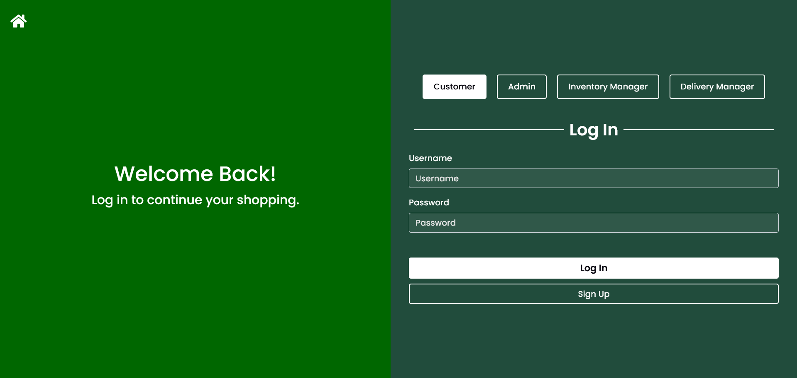

## Table of Contents

- [Features](#features)
- [Architecture](#architecture)
- [Installation](#installation)
- [Database Setup](#database-setup)
- [Usage](#usage)
- [Project Structure](#project-structure)
- [Screenshots](#screenshots)
- [Technologies Used](#technologies-used)
- [License](#license)

---

## Features

- Product catalog with category browsing
- Shopping cart with real-time quantity management
- User registration, login, and authentication
- Order placement, order history, and tracking
- Admin dashboard for product, inventory, and delivery management
- Inventory manager role for stock and product oversight
- Delivery personnel management
- MySQL-backed database (schema in `gos.sql`)
- Responsive UI using Bootstrap

---

## Architecture

- **Frontend:** JSP, HTML, CSS, Bootstrap, JavaScript
- **Backend:** Java Servlets, JSP
- **Database:** MySQL
- **App Server:** Apache Tomcat 9

---

## Installation

1. **Clone this repository:**
   ```bash
   git clone https://github.com/OsandaMadugalle/online-grocery-ordering-system.git
   cd online-grocery-ordering-system
   ```

2. **Install dependencies:**
   - Java 22+
   - Apache Tomcat 9
   - MySQL

3. **Configure your database:**
   - Create a MySQL database named `gos`.
   - Import the schema:
     ```bash
     mysql -u yourusername -p gos < gos.sql
     ```
   - Update DB credentials in `src/main/java/com/gos/util/ConnectionData.java`.

4. **Deploy the application:**
   - Build in your Java IDE or via Maven/Gradle.
   - Deploy to Tomcat’s `webapps` directory.
   - Access via `http://localhost:8080/online-grocery-ordering-system`

---

## Database Setup

- The SQL schema is provided in `gos.sql` at the project root.
- Edit your MySQL credentials in `ConnectionData.java` as needed.

---

## Usage

- **Customer:** Browse products, add to cart, register/login, and place orders.
- **Admin:** Manage products, inventory, inventory managers, and delivery personnel.
- **Inventory Manager:** Oversee stock and update product info.
- **Delivery Personnel:** (If implemented) Assigned to fulfill orders.

---

## Project Structure

- `src/main/webapp/webContent/` — JSPs for shopping, categories, contact, etc.
- `src/main/webapp/customer/` — Customer and admin/manager panels
- `src/main/java/com/gos/` — Java backend (models, services)
- `gos.sql` — SQL schema

---

## Screenshots

### Homepage


### Sign Up


### Log In


---

## Technologies Used

- Java (JSP/Servlets)
- MySQL
- Apache Tomcat 9
- Bootstrap
- HTML/CSS/JavaScript

---

## License

This project is for educational and demonstration purposes. Contact the author for other uses.
